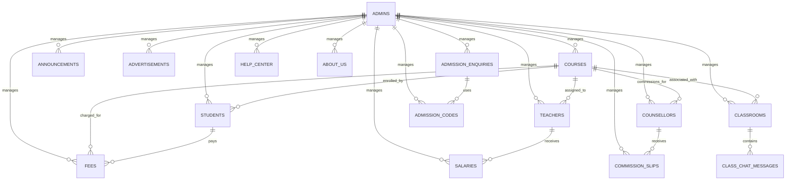

# VWINGS24X7 Backend API

A comprehensive FastAPI-based backend application for VWINGS24X7, an educational platform managing admin, students, teachers, counsellors, courses, admissions, fees, salaries, and more with PostgreSQL database integration.

## Features

- **User Management**: Registration and authentication for admins, students, teachers, and counsellors with auto-generated IDs.
- **Course Management**: CRUD operations for courses with detailed requirements, photos, and videos.
- **Admission System**: Admission codes and enquiry management for student admissions.
- **Classroom Management**: Virtual classrooms with chat functionality for interactive learning.
- **Financial Management**: Commission tracking, salary management, and fee collection with receipt uploads.
- **Content Management**: Announcements, advertisements, about us, and help center sections.
- **File Uploads**: Support for profile photos, course media, salary slips, fee receipts, and more.
- **RESTful API**: Comprehensive endpoints with automatic API documentation.
- **CORS Enabled**: Cross-origin requests allowed for frontend integration.
- **Health Monitoring**: Built-in health check endpoint.
- **PostgreSQL Integration**: Robust database with automatic table creation.

## File Structure

```
VWINGS24X7-App-Backend/
├── main.py                          # FastAPI application entry point and router registration
├── db.py                            # Database configuration and table creation
├── requirements.txt                 # Python dependencies
├── README.md                        # Project documentation
├── models/                          # SQLAlchemy database models
│   ├── __init__.py
│   ├── auth/
│   │   ├── admin_models.py          # Admin user model
│   │   ├── student_models.py        # Student user model
│   │   ├── teacher_models.py        # Teacher user model
│   │   └── counsellor_models.py     # Counsellor user model
│   ├── courses/
│   │   └── course_models.py         # Course information model
│   ├── aboutus/
│   │   └── about_us_models.py       # About us content model
│   ├── help_center/
│   │   └── help_center_models.py    # Help center queries model
│   ├── admission/
│   │   ├── admission_code_models.py # Admission codes model
│   │   └── admission_enquiry_models.py # Admission enquiries model
│   ├── ads/
│   │   └── ads_models.py            # Advertisements model
│   ├── announcement/
│   │   └── announcement_models.py   # Announcements model
│   ├── classroom/
│   │   ├── classroom_models.py      # Classroom details model
│   │   └── class_chat_models.py     # Classroom chat messages model
│   ├── commission/
│   │   └── commission_models.py     # Commission slips model
│   ├── salary/
│   │   └── salary_models.py         # Salary records model
│   └── fees/
│       └── fees_models.py           # Fee collection model
├── routes/                          # API route handlers
│   ├── __init__.py
│   ├── auth/
│   │   ├── admin_routes.py          # Admin authentication routes
│   │   ├── student_routes.py        # Student management routes
│   │   ├── teacher_routes.py        # Teacher management routes
│   │   └── counsellor_routes.py     # Counsellor management routes
│   ├── courses/
│   │   └── course_routes.py         # Course CRUD routes
│   ├── aboutus/
│   │   └── about_us_routes.py       # About us content routes
│   ├── help_center/
│   │   └── help_center_routes.py    # Help center routes
│   ├── admission/
│   │   ├── admission_code_routes.py # Admission code routes
│   │   └── admission_enquiry_routes.py # Admission enquiry routes
│   ├── ads/
│   │   └── ads_routes.py            # Advertisement routes
│   ├── announcement/
│   │   └── announcement_routes.py   # Announcement routes
│   ├── classroom/
│   │   ├── classroom_routes.py      # Classroom management routes
│   │   └── class_chat_routes.py     # Classroom chat routes
│   ├── commission/
│   │   └── commission_routes.py     # Commission management routes
│   ├── salary/
│   │   └── salary_routes.py         # Salary management routes
│   └── fees/
│       └── fees_routes.py           # Fee collection routes
├── services/                        # Business logic and utilities
│   ├── __init__.py
│   ├── admin_id_generator.py        # Admin ID generation service
│   ├── student_id_generator.py      # Student ID generation service
│   ├── teacher_id_generator.py      # Teacher ID generation service
│   ├── counsellor_id_generator.py   # Counsellor ID generation service
│   ├── course_id_generator.py       # Course ID generation service
│   ├── class_id_generator.py        # Classroom ID generation service
│   ├── commission_id_generator.py   # Commission ID generation service
│   ├── salary_id_generator.py       # Salary ID generation service
│   ├── fees_id_generator.py         # Fees ID generation service
│   ├── admission_enquiry_id_generator.py # Admission enquiry ID generation
│   └── report_id_generator.py       # Report ID generation service
├── static/                          # Static assets (logos, etc.)
├── uploads/                         # Uploaded files directory
│   ├── ads/                         # Advertisement images
│   ├── classrooms/                  # Classroom photos
│   ├── commissions/                 # Commission documents
│   ├── counsellor/                  # Counsellor profile photos
│   ├── courses/                     # Course photos and videos
│   ├── fees/                        # Fee receipts
│   ├── salaries/                    # Salary slips
│   ├── students/                    # Student profile photos
│   └── teacher/                     # Teacher profile photos
└── __pycache__/                     # Python bytecode cache
```

## Database Architecture

The application uses PostgreSQL with SQLAlchemy ORM. Below is the Entity-Relationship diagram showing the main tables and their relationships:



### Key Tables Description

- **admins**: Administrative users with login credentials
- **students**: Student profiles with course enrollment and personal details
- **teachers**: Teacher profiles with assigned courses and salary information
- **counsellors**: Counsellor profiles with commission structures
- **courses**: Course catalog with requirements and media
- **classrooms**: Virtual classrooms for course delivery
- **fees**: Fee collection records with receipts
- **salaries**: Teacher salary records with slips
- **commission_slips**: Counsellor commission payments
- **admission_codes**: Admission code management
- **admission_enquiries**: Student admission requests
- **announcements**: Platform announcements
- **advertisements**: Promotional content
- **about_us**: Company information
- **help_center**: Support queries
- **class_chat_messages**: Classroom discussion messages

## Dependencies

The project uses the following Python packages:

- **fastapi**: Modern, fast web framework for building APIs with Python 3.7+ based on standard Python type hints.
- **uvicorn[standard]**: ASGI web server implementation for Python, used to run the FastAPI application with auto-reload and logging.
- **sqlalchemy**: SQL toolkit and Object-Relational Mapping (ORM) library for Python, providing database abstraction.
- **psycopg2-binary**: PostgreSQL database adapter for Python, enabling connection to PostgreSQL databases.
- **python-dotenv**: Library for reading environment variables from a .env file, used for secure configuration management.
- **pydantic[email]**: Data validation library with email validation support, used for request/response models.
- **python-multipart**: Library for handling multipart/form-data requests, essential for file upload functionality.

## How to Clone the Repository and Run the Project

### Prerequisites

- Python 3.8 or higher
- PostgreSQL database
- pgAdmin (optional, for database management)
- Git

### 1. Clone the Repository

```bash
git clone <repository-url>
cd VWINGS24X7-App-Backend
```

### 2. Create Virtual Environment

```bash
# Create virtual environment
python3 -m venv venv

# Activate virtual environment
# On macOS/Linux:
source venv/bin/activate

# On Windows:
# venv\Scripts\activate
```

### 3. Install Dependencies

```bash
pip install -r requirements.txt
```

### 4. Configure Database

Create a `.env` file in the root directory with your PostgreSQL credentials:

```env
DB_HOST=localhost
DB_PORT=5432
DB_USER=postgres
DB_PASSWORD=your_password_here
DB_NAME=vwings24x7_db
```

### 5. Create Database

Create the PostgreSQL database using pgAdmin or psql:

```sql
CREATE DATABASE vwings24x7_db;
```

### 6. Run the Backend Server

```bash
python main.py
```

Or using uvicorn directly:

```bash
uvicorn main:app --host 0.0.0.0 --port 8000 --reload
```

The server will start on `http://0.0.0.0:8000` (accessible from any IP)

Database tables will be created automatically on startup.

## API Documentation

Once the server is running, visit:
- Swagger UI: `http://localhost:8000/docs`
- ReDoc: `http://localhost:8000/redoc`

## Future Scope of Development

### Android App Development
- **Mobile-First Design**: Develop a native Android application for students, teachers, and counsellors to access the platform on-the-go.
- **Offline Capabilities**: Implement offline access to course materials and assignments with sync functionality.
- **Push Notifications**: Real-time notifications for announcements, class schedules, and fee reminders.
- **Camera Integration**: Direct photo/video upload for assignments and profile updates.
- **Payment Gateway**: Integrated payment system for fee collection via mobile wallets and cards.

### iOS App Development
- **Cross-Platform Consistency**: Mirror Android app features with iOS-specific optimizations.
- **iCloud Integration**: Sync user data across devices using iCloud.
- **Siri Integration**: Voice commands for common actions like checking schedules or submitting assignments.
- **Apple Pay**: Seamless fee payments using Apple Pay.
- **ARKit Support**: Augmented reality features for interactive learning modules.

### Additional Features for Both Platforms
- **Biometric Authentication**: Fingerprint/Face ID login for enhanced security.
- **Chat Integration**: Real-time messaging within classrooms.
- **Progress Tracking**: Visual dashboards for course completion and performance analytics.
- **Live Streaming**: Integrated video conferencing for virtual classes.
- **Gamification**: Achievement badges and leaderboards to motivate learners.

## Report Query to Developer

For any issues, feature requests, or technical support, please contact:

**Rajdeep Dey**  
Email: naiyooffice@gmail.com

Please include the following information in your report:
- Detailed description of the issue
- Steps to reproduce
- Expected vs. actual behavior
- Screenshots (if applicable)
- System information (OS, Python version, etc.)

## License

MIT
